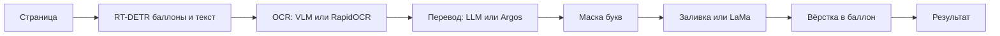

# Image Localization Tool

Локальный перевод текста на изображениях (комиксы, манга, скриншоты): детекция баллонов, OCR и перевод через OpenAI-совместимый LLM, очистка букв, вёрстка перевода в форму баллона.

Качество зависит от страницы и модели. На эталонных прогонах ink recall маски букв был 99.8–100% (см. [docs/BENCHMARK_RESULTS.md](docs/BENCHMARK_RESULTS.md)); на произвольных страницах это не гарантировано. SFX и надписи на предметах по умолчанию не переводятся. Узкие баллоны переносятся по слогам; текст на скринтоне чистится хуже ровного баллона.

## Как это работает



1. **Детектор** (ogkalu RT-DETR-v2 ONNX) находит баллоны и текстовые области.
2. **OCR страницы** через vision-модель на LLM-сервере. Если сервер недоступен — RapidOCR и предупреждение.
3. **Перевод сценария** через LLM (говорящий, род, глоссарий). Фолбэк — Argos на целых блоках.
4. **Маска букв** только у переводимых регионов; однородный фон заливается, остальное чистит LaMa-manga.
5. **Вёрстка** в форму баллона (шрифт Heroika и каталог OFL-шрифтов, перенос через pyphen).

Поддерживаемые форматы: PNG, JPG/JPEG, BMP, TIFF. Прозрачность PNG не сохраняется.

## Требования

- Python **3.10–3.13** (на 3.14 возможны проблемы с `torch`).
- Windows 10/11 для окна (нужен [Microsoft Edge WebView2 Runtime](https://developer.microsoft.com/microsoft-edge/webview2/)).
- Опционально: GPU с CUDA для LaMa и ускорения.
- OpenAI-совместимый сервер с **vision**-моделью для OCR (VLM). Без него пайплайн уходит на RapidOCR + Argos.

## Установка

```powershell
python -m venv venv
venv\Scripts\activate
pip install -r requirements.txt
python scripts\setup_models.py
# GPU (CUDA):
python scripts\setup_models.py --torch-cuda
```

Скрипт скачивает:

| Файл | Куда |
|------|------|
| Детектор ogkalu (int8 ONNX) | `models/` |
| LaMa-manga | `models/anime-manga-big-lama.pt` |
| Шрифт Heroika (OFL) | `src/resources/fonts/` |

Модели в git не входят. Проверка LLM: `python scripts\setup_models.py --llm-url http://127.0.0.1:8080/v1`.

## Локальный LLM-сервер

Нужен эндпоинт OpenAI Chat Completions (`/v1/chat/completions`) и список моделей (`/v1/models`). Для OCR страница уходит как картинка — модель должна поддерживать vision.

Примеры:

**llama.cpp** (`llama-server`, порт по умолчанию 8080):

```powershell
llama-server -m path\to\vision-model.gguf --port 8080
```

**LM Studio** — включить Local Server, взять URL вида `http://127.0.0.1:1234/v1`.

**Ollama** — OpenAI-совместимый прокси (часто `http://127.0.0.1:11434/v1`) и vision-модель.

Где задать адрес:

| Режим | Настройка |
|-------|-----------|
| CLI | `config.json` → `llm_base_url`, или флаг `--llm-url` |
| Окно | Настройки → адрес LLM. По умолчанию пусто |
| Ключ API | В окне через «секрет»; хранится в keyring (`ImageLocalizationTool` / `llm`), в JSON не пишется |

Пример `config.json` (создаётся рядом с CLI при сохранении, в git не входит):

```json
{
  "source_lang": "en",
  "target_lang": "ru",
  "llm_base_url": "http://127.0.0.1:8080/v1",
  "llm_model": "",
  "ocr_backend": "vlm",
  "translator_backend": "llm",
  "inpainter_backend": "lama",
  "reading_order": "auto",
  "sfx_mode": "skip",
  "device": "auto"
}
```

Пустой `llm_model` берётся из `/v1/models`.

## Запуск CLI

```powershell
python src\main.py page.png out.png --source-lang en --target-lang ru
python src\main.py page.png out.png --llm-url http://127.0.0.1:8080/v1 --debug-dir output\page
python src\main.py chapter\ output\translated --recursive --skip-existing
```

Полезные флаги: `--ocr vlm|rapid`, `--translator llm|argos`, `--inpainter lama|opencv`, `--translate-sfx`, `--glossary names.json`, `--rerender regions.json`.

Оценка на своих эталонах (папка с `page.ext` + `page-mask.ext`):

```powershell
python scripts\eval_pipeline.py --images path\to\pages
```

## Окно приложения

```powershell
python -m src.app
python -m src.app --browser
python -m src.app page.png папка
```

Без флага открывается окно (pywebview + WebView2). `--browser` поднимает тот же локальный HTTP на `127.0.0.1` и открывает системный браузер. Повторный запуск передаёт пути уже открытому экземпляру.

Данные:

| Режим | Где |
|-------|-----|
| Портативный | рядом с программой есть каталог `data/` |
| Windows (обычный) | `%APPDATA%\ImageLocalizationTool\`, `%LOCALAPPDATA%\ImageLocalizationTool\` |
| Другие ОС | `~/.image-localization-tool/` |

Подробности API, SSE, горячих клавиш и хранения проектов: [docs/APP.md](docs/APP.md).

## Сеть (LAN) и расширение браузера

Удалённый API — отдельный слушатель, по умолчанию выключен. Локальный интерфейс всегда только `127.0.0.1`.

```powershell
python -m src.app --headless --remote
```

- LAN API: `remote_bind` / `remote_port` (по умолчанию `0.0.0.0:8765`), маршруты `/v1/...`.
- Локальный код сопряжения: `127.0.0.1:8766`, токен сессии в `data/session.token`.
- Сопряжение: код из 6 цифр → `POST /v1/pair` → Bearer-токен устройству.
- Трафик в LAN — обычный HTTP без TLS. Брандмауэр Windows может блокировать входящие, пока не разрешите порт в частной сети.

Расширение (Chromium / Firefox):

```powershell
python scripts\build-extension.py
```

Загрузить `dist/chromium` или `dist/firefox` как распакованное дополнение. Настройки: URL сервера и код сопряжения. Описание: [docs/EXTENSION.md](docs/EXTENSION.md).

## Сборка и деплой (Windows)

Версия задаётся в `src/app/__init__.py` (`__version__`).

```powershell
# Нужны: venv с зависимостями, PyInstaller, Inno Setup 6 (для установщика)
.\scripts\build-windows.ps1
.\scripts\build-windows.ps1 -SkipInno
.\scripts\build-windows.ps1 -SkipPyInstaller
```

Результат:

- `dist\ImageLocalizationTool\` — onedir: exe, `web\`, `fonts\`, рядом копируются `models\` если они есть.
- Установщик: `dist\ImageLocalizationTool-<version>-windows-x64-setup.exe` (ставит WebView2 при необходимости).

Проверка каталога сборки: `python scripts\smoke_dist.py`.

**Headless на домашнем ПК / в LAN:** соберите или запустите из исходников `python -m src.app --headless --remote`, откройте порт 8765 в брандмауэре для частной сети, сопрягите расширение или клиент по `/v1`. Не выставляйте слушатель в интернет без дополнительной защиты — протокол без шифрования, рассчитан на локальную сеть.

## Тесты

```powershell
python -m pytest tests/ -v -m "not slow and not ui"
python -m pytest tests/e2e/test_ui_smoke.py -v -m ui
```

Маркеры: `slow`, `ui`, `requires_argos`, `requires_llm`.

## Структура

```
src/
├── app/                 # Окно, HTTP API, LAN, воркер
├── main.py              # CLI
├── page_pipeline.py     # Пайплайн
├── config.py            # Config / config.json
├── models.py            # TextRegion, PageResult
└── components/          # Детектор, OCR, перевод, маска, LaMa, вёрстка
web/                     # Интерфейс окна
extension/               # Исходники расширения
scripts/                 # setup_models, eval_pipeline, build-windows, build-extension
docs/                    # APP, EXTENSION, ROADMAP, BENCHMARK_RESULTS
tests/
```

## Сторонние компоненты

| Компонент | Источник | Лицензия / заметка |
|-----------|----------|-------------------|
| Детектор ogkalu | [Hugging Face](https://huggingface.co/ogkalu/comic-text-and-bubble-detector) | скачивается отдельно |
| LaMa-manga | [Sanster/models](https://github.com/Sanster/models) | скачивается отдельно |
| Heroika и OFL-шрифты | OFL 1.1 | лежат в `src/resources/fonts/` |
| Argos Translate | git-зависимость в `requirements.txt` | оффлайн-фолбэк перевода |

## Спецификации

Следующая фича идёт через Spec Kit: `/speckit-specify`, затем `/speckit-plan`, `/speckit-tasks`, `/speckit-implement` и `/speckit-converge`. Каталог фич — `specs/`. Принципы проекта — `.specify/memory/constitution.md`.

## Лицензия

MIT — см. [LICENSE](LICENSE).
